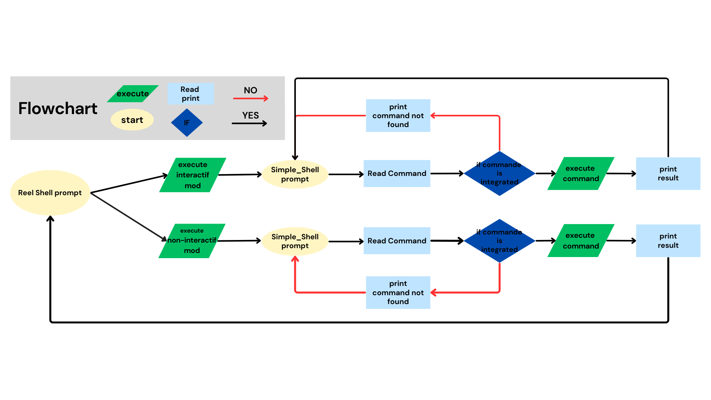

# holbertonschool-simple_shell## Table of Contents
## Background Context

Write a simple UNIX command interpreter.


“The Gates of Shell”, by Spencer Cheng, featuring Julien Barbier

- [Flowcharts](#flowcharts)
- [Getppid et Getpid](#getppid_getpid)
- [Execve](#execve)
- [Stat](#stat)
- [Strtok](#strtok)
- [Main.h](#mainh)
- [Contributors](#contributors)
- [License](#license)

# Flowcharts


# Getppid et Getpid

 Are integrated functions defined in the Unistd.H` library.
`getppid()` : Returns the parent process of the calling process.If the calling process was created by the `Fork () function and the parent process still exists at the time of the call of the` Getppid` function, this function returns the process ID of the parent process.Otherwise, this function returns a value of 1 which is the identifier of the initialization process.

## Syntaxe:
```c
pid_t getppid(void);
```
## Type of return:
`Getppid ()`

Returns the parent process ID from the current process.He never generates an error and therefore always succeeds.


# Max value of an ID
To write a shell script that prints the maximum value than a process ID (PID) `Can have, you can use the CAT command to read the`/proc/sys/Kernel/Pid_max` file.This file contains the maximum value that a PID can reach on your system.

## Example of Shell Script
### Here is an example of shell script does this:
`` c
#!/Bin/bash
`` `
### Read the maximum value of a PID from/proc/sys/kernel/pid_max
`` c
max_pid = $ (cat/proc/sys/kernel/pid_max)
`` `
### Display the maximum value of the PID
`` c
Echo "The maximum value a process ID can be: $ max_pid"
`` `

# execve

The `` Execve` System Call is used to replace the image of an executed process with a new image, which is that of another program.When a process calls, the current program is replaced by the program specified in the call, and if Execve succeeds, it never returns to the original program.

# Important points on Execve
Complete replacement of the process: The current program is completely replaced by the new program.This means that the code after Execve will never be executed if Execve succeeds.

## Three main arguments:

Path to the program:
The absolute path of the program to be executed (eg /bin /ls).
Arguments: A table of character strings (ARGV) which represents the arguments of the program (eg ARGV [0] is the name of the program).

## Environment :
A table of character strings representing the environment of the process (e.g. ESPP contains environmental variables like path).

# stat

In C, `Stat` is a function used to obtain information on a file or directory.This function fulfills a Stat structure with details on the file, such as its size, its permissions, its date of modification, etc.

Here's how it works:
`Stat`: Before calling the function, you must declare a variable type `Struct Stat`qui that will contain information on the file.

Call of the function `Stat`: You pass the name of the file and the address of your structure stati 'to the function.The function fulfills the structure with the file data.

Access to information: After calling `stat`, you can access the various information via the fields of the Stat` Structure.

# Strtok

The Strtok function in C is used to segment a chain of characteristics in sub-chains called "tokens" `, using specified delimitors.She takes a pointer to the chain to segment and a chain of delimitors as a starter.During the first call, the complete chain is analyzed, and for the following calls, we make a null to continue the analysis of the same channel. Strtok 'returns a pointer to each successive token, allowing to travel the token segmented chain by Token.

Example:
`` c
#include <stdio.h>
#include <stdlib.h>
#include <string.h>

int main(int argc, char *argv[])
{
	char *str1, *token;
	int j;

	if (argc != 3)
	{
		fprintf(stderr, "Usage: %s string delim\n", argv[0]);
		exit(EXIT_FAILURE);
	}

	for (j = 1, str1 = argv[1];; j++, str1 = NULL)
	{
	token = `strtok`(str1, argv[2]);
	if (token == NULL) break;
	printf("%d: %s\n", j, token);
	}

	exit(EXIT_SUCCESS);
}

```
Example of command:
```c

./program "Temporary string to be parsed"

sortie:
1: Temporary
2: string
3: to
4: be
5: parsed
```

# Main.h

Protective guard (#ifndef, #define, #endif):

### Library inclusions:

You include the necessary standard libraries (Stdio.h, Stdlib.h, Unistd.h, String.h, Sys/Type.h, Sys/Wait.h).These inclusions provide the necessary definitions for the functions and types used in your code.
Declaration of external variables:

approximately char **;: Declares the approximately global variable which contains the environment variables.It is a good practice to declare approximately as extern if it is used in several source files.

## Definition macros :

### define max_arguments 50:
Defines the maximum number of arguments that the shell can manage.You can adjust this value according to your needs.

#define max_command_length 1024:
defines the maximum length of a command.You can also adjust this value according to the needs of your shell.

### Function declaration:

`void print_env (void);`: Declaration of the function that displays the environment variables.

`void check_exit_command (char *buffer);`: Declaration of the function which checks if the order is "exit" and ends the program if this is the case.

`Char *Find_Command_Path (Const Char *command);`: Declaration of the function which finds the full path of a command using the `Environment variable 'Path.

`char *my_getenv (Const char *name);`: Declaration of the function which recovers the value of an `` environment variable '.

`void free_argv (char ** argv);`: Declaration of the function which releases the memory allocated for the arguments.

`char ** split_string (int max_argument;`;: Declaration of the function which reads a command line and divides it into arguments.

`int execute_command (int max_argument, char ** envp);`: Declaration of the function that performs orders.

## Print_env function

Declares a function that will display all current environment variables.

## extern char **environ; :

This line declares an approximately external variable which contains environmental variables for the program.
It is a table of pointers on character strings, each chain representing an environment variable in the name form = value.

## Check_ Exit_command
But: Check if the user entered the "exit" command.If this is the case, release the memory allocated for `Buffer` and leave the program.

How :

`Strcmp (Buffer," exit ") == 0`: Compare the character string in` Buffer 'with "Exit".If they are identical, the function returns 0, and therefore the condition is true.

If the condition is true, the program releases the memory allocated to `Buffer 'with` free (buffer) `to avoid memory leaks.

`Exit (0)` is then called to leave the program properly with a 0 output code, indicating that everything went well.


## FUNCTION FIND_COMMAND_PATH

But: to find the full path of an order by seeking in the directories specified by the `` environment variable '' .Path

#### Setting :

Command: The name of the order to find.

### returns:

The full path of the command if it is found and executable.

`Null if the order is not found or if an error occurs.

## How the function works:
### Check the absolute command:

If the command begins with a `. '(Which means that it is an absolute path), the function checks if the file exists and is executable with.If this is the case, she returns a copy of the order of the command./access( Process, x_ok)

### Recovery of the environment:

The function recovers the value of using.This variable contains a list of directories separated by where commands can be found. Path my_getenv ("path"):

### Duplication and path treatment:

The variable is duplicated to be manipulated without modifying the original value.This duplication is necessary because changes the character string on which it works.

### Search in each repertoire:

The function uses to divide into different directories, then builds the full path by combining each directory with the command using.'Strtok`path_copysnprintf
For each path built, is used to check if the file exists and is executable.

### Back to the path found or null:

If the order is found, the function returns to the full path.
If the order is not found after having traveled all the directories, the allocated memory is released, and the function returns.


## Authorized System Functions and Calls:

### 1. Functions of the standard library C (String.h):
`Strtok`: divides a chain into sub-chain based on delimitors.

### 2. Functions related to files and directories:
- Access: Check the access permissions to a file.
- Chdir: Changes the current work directory.
- Close: closes a file descriptor.
- Open: opens a file and returns a file descriptor.
- Opendir: opens a repertoire and returns a pointer to this repertoire.
- Closedir: closes an open directory.
- Readdir: bed a directory entrance.
- Stat: Obtains information on a file (mode, size, etc.).
- LSTAT: Similar to stat, but follows symbolic links.
- FSTAT: Gets information on a file from a file descriptor.
- GetcWD: Obtains the current work directory.

### 3. Memory management functions:
- Malloc: allocates a block of memory.
- Free: release a allocated memory block.

### 4. Input/output functions:
- Printf: Formate and displays a chain on the standard output.
- FPRINTF: Format and displays a chain on a specified flow.
- VFPRINTF: Variant of Fprintf which takes a list of VA_List type arguments.
- Sprintf: format and stores a chain in a stamp.
- putchar: displays a character on the standard output.
- FFLUSH: empty the output stamp of a flow.
- Getline: reads a line from a flow and allocates it dynamically.
### 5. Functions related to processes:
- Fork: Creates a new process by duplicating the calling process.
- Exercise: replaces the image of the current process with a new program.
- Wait: Wait for the end of a child process.
- Waitpid: awaits the end of a specific child process.
- Wait3: awaits the end of a child process and recovers information on the use of resources.
- Wait4: similar to Wait3, but awaits the end of a specific process.
- Getpid: Obtains the process identifier of the calling process.
- Kill: Send a signal to a process.
- Signal: Change the way the signals are processed.

### 6. File management functions:
- READ: Data bed from a file descriptor.
- Write: writes data on a file descriptor.

### 7. File management functions:
- _Exit: immediately ends a process without calling the cleaning functions.
- Exit: ends a process and calls for cleaning functions before output.

### 8. Various functions:
- Isatty: check if a file descriptor is associated with a terminal.
- Perror: displays an error message based on the Errno Global Error Code.
- putchar: displays a character on the standard output.

### Contributors
Stef R, Lamine.M.B

### LICENSE
This project is licensed under the MIT License. See the [LICENSE](LICENSE) file for more information.

