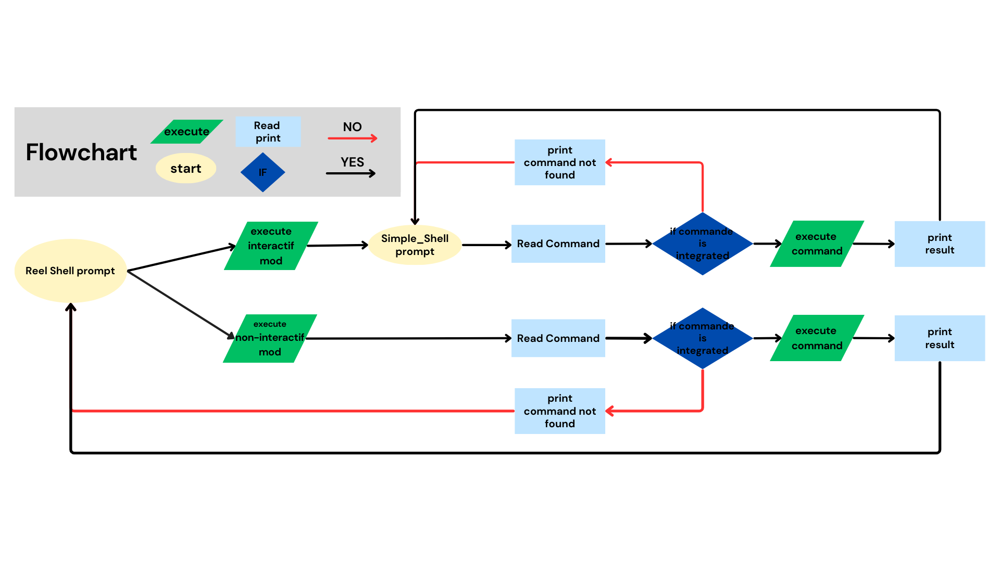

# holbertonschool-simple_shell## Table of Contents
## Background Context
Write a simple UNIX command interpreter.


^ “The Gates of Shell”, by Spencer Cheng, featuring Julien Barbier

- [Flowcharts](#flowcharts)
- [Getppid et Getpid](#getppid_getpid)
- [Execve](#execve)
- [Stat](#stat)
- [Strtok](#strtok)
- [Main.h](#mainh)
- [Contributors](#contributors)
- [License](#license)

# Flowcharts


# Getppid et Getpid

 Sont des fonctions intégrées définies dans la bibliothèque `unistd.h` .

`getppid()` : renvoie l'ID de processus du parent du processus appelant. Si le processus appelant a été créé par la fonction `fork()` et que le processus parent existe toujours au moment de l'appel de la fonction `getppid`, cette fonction renvoie l'ID de processus du processus parent. Sinon, cette fonction renvoie une valeur de 1 qui est l'identifiant du processus d'initialisation .

## Syntaxe:
```c
pid_t getppid(void);
```
## Type de retour :
`getppid()`

renvoie l'ID de processus du parent du processus actuel. Il ne génère jamais d’erreur et réussit donc toujours.


# Valeur max d'un ID
Pour écrire un script shell qui imprime la valeur maximale qu'un `ID de processus (PID)` peut avoir, tu peux utiliser la commande cat pour lire le fichier `/proc/sys/kernel/pid_max`. Ce fichier contient la valeur maximale qu'un PID peut atteindre sur ton système.

## Exemple de Script Shell
### Voici un exemple de script shell qui fait cela :
```c
#!/bin/bash
```
### Lire la valeur maximale d'un PID depuis /proc/sys/kernel/pid_max
```c
max_pid=$(cat /proc/sys/kernel/pid_max)
```
### Afficher la valeur maximale du PID
```c
echo "The maximum value a process ID can be: $max_pid"
```

# execve

L'appel système `execve` est utilisé pour remplacer l'image d'un processus en cours d'exécution par une nouvelle image, qui est celle d'un autre programme. Lorsqu'un processus appelle execve, le programme en cours est remplacé par le programme spécifié dans l'appel, et si execve réussit, il ne retourne jamais au programme original.

## Points importants sur execve
Remplacement complet du processus : Le programme en cours est complètement remplacé par le nouveau programme. Cela signifie que le code après execve ne sera jamais exécuté si execve réussit.

## Trois arguments principaux :

Chemin vers le programme :
Le chemin absolu du programme à exécuter (ex. /bin/ls).
Arguments : Un tableau de chaînes de caractères (argv) qui représente les arguments du programme (ex. argv[0] est le nom du programme).

## Environnement :
Un tableau de chaînes de caractères représentant l'environnement du processus (ex. envp contient les variables d'environnement comme PATH).

# stat

En C, `stat` est une fonction utilisée pour obtenir des informations sur un fichier ou un répertoire. Cette fonction remplit une structure stat avec des détails sur le fichier, comme sa taille, ses permissions, sa date de modification, etc.

Voici comment cela fonctionne :
`Structure stat` : Avant d'appeler la fonction, tu dois déclarer une variable de type `struct stat`qui va contenir les informations sur le fichier.

Appel de la fonction `stat` : Tu passes le nom du fichier et l'adresse de ta `structure stat` à la fonction. La fonction remplit la structure avec les données du fichier.

Accès aux informations : Après l'appel de `stat`, tu peux accéder aux différentes informations via les champs de la `structure stat`.

# strtok

La fonction ``strtok`` en C est utilisée pour segmenter une chaîne de caractères en sous-chaînes appelées `"tokens"`, en utilisant des délimiteurs spécifiés. Elle prend en entrée un pointeur vers la chaîne à segmenter et une chaîne de délimiteurs. Lors du premier appel, la chaîne complète est analysée, et pour les appels suivants, on passe `NULL` pour continuer l'analyse de la même chaîne. ``strtok`` renvoie un pointeur vers chaque token successif, permettant de parcourir la chaîne segmentée token par token.

Exemple:
```c
#include <stdio.h>
#include <stdlib.h>
#include <string.h>

int main(int argc, char *argv[])
{
	char *str1, *token;
	int j;

	if (argc != 3)
	{
		fprintf(stderr, "Usage: %s string delim\n", argv[0]);
		exit(EXIT_FAILURE);
	}

	for (j = 1, str1 = argv[1];; j++, str1 = NULL)
	{
	token = `strtok`(str1, argv[2]);
	if (token == NULL) break;
	printf("%d: %s\n", j, token);
	}

	exit(EXIT_SUCCESS);
}

```
Exemple de commande :
```c

./program "Temporary string to be parsed"

sortie:
1: Temporary
2: string
3: to
4: be
5: parsed
```

# Main.h

Garde de protection (#ifndef, #define, #endif):

Inclusions de bibliothèques:

Vous incluez les bibliothèques standard nécessaires (stdio.h, stdlib.h, unistd.h, string.h, sys/types.h, sys/wait.h). Ces inclusions fournissent les définitions nécessaires pour les fonctions et types utilisés dans votre code.
Déclaration des variables externes:

extern char **environ; : Déclare la variable globale environ qui contient les variables d'environnement. C'est une bonne pratique de déclarer environ comme extern si elle est utilisée dans plusieurs fichiers source.
Définition des constantes:

#define MAX_ARGUMENTS 50 : Définit le nombre maximum d'arguments que le shell peut gérer. Vous pouvez ajuster cette valeur en fonction de vos besoins.
#define MAX_COMMAND_LENGTH 1024 : Définit la longueur maximale d'une commande. Vous pouvez également ajuster cette valeur selon les besoins de votre shell.
Déclaration des fonctions:

`void print_env(void)`; : Déclaration de la fonction qui affiche les variables d'environnement.

`void check_exit_command(char *buffer)`; : Déclaration de la fonction qui vérifie si la commande est "exit" et termine le programme si c'est le cas.

`char *find_command_path(const char *command)`; : Déclaration de la fonction qui trouve le chemin complet d'une commande en utilisant la `variable d'environnement` PATH.

char *my_getenv(const char *name); : Déclaration de la fonction qui récupère la valeur d'une `variable d'environnement`.

`void free_argv(char **argv)`; : Déclaration de la fonction qui libère la mémoire allouée pour les arguments.

`char **split_string(int max_argument)`; : Déclaration de la fonction qui lit une ligne de commande et la divise en arguments.

`int execute_command(int max_argument, char **envp)`; : Déclaration de la fonction qui exécute les commandes.

## Fonction print_env

### Déclaration et initialisation :

char **env; : Déclare un pointeur vers un pointeur de caractères, utilisé pour parcourir le tableau environ.
env = environ; : Initialise env avec la variable globale environ, qui est un tableau de chaînes de caractères représentant les variables d'environnement.
Boucle de parcours :

while(*env) : La boucle continue tant que le pointeur env ne pointe pas sur NULL. Chaque élément du tableau environ est une chaîne de caractères représentant une `variable d'environnement`.

`printf("%s\n", *env)`; : Affiche la chaîne de caractères pointée par env.
env++; : Passe au prochain élément du tableau.


## Fonction check_exit_command
But : Vérifier si l'utilisateur a entré la commande "exit". Si c'est le cas, libérer la mémoire allouée pour `buffer` et quitter le programme.

Comment :

`strcmp(buffer, "exit") == 0` : Compare la chaîne de caractères dans `buffer` avec "exit". Si elles sont identiques, la fonction retourne 0, et donc la condition est vraie.

Si la condition est vraie, le programme libère la mémoire allouée à `buffer` avec `free(buffer)` pour éviter les fuites de mémoire.

`exit(0)` est ensuite appelé pour quitter proprement le programme avec un code de sortie 0, indiquant que tout s'est bien déroulé.


## Fonction find_command_path

But : Trouver le chemin complet d'une commande en recherchant dans les répertoires spécifiés par la ``variable d'environnement`` .PATH

#### Paramètre :

command : Le nom de la commande à trouver.

#### Retourne :

Le chemin complet de la commande si elle est trouvée et exécutable.

`NULL` si la commande n'est pas trouvée ou si une erreur survient.

## Comment la fonction fonctionne :

### Vérification de la commande absolue :

Si la commande commence par un `.` (ce qui signifie qu'il s'agit d'un chemin absolu), la fonction vérifie si le fichier existe et est exécutable avec . Si c'est le cas, elle retourne une copie du chemin de la commande./access(command, X_OK)

### Récupération de la `variable d'environnement` `PATH` :

La fonction récupère la valeur de  à l'aide de . Cette variable contient une liste de répertoires séparés par des  où les commandes peuvent être trouvées.PATH my_getenv("PATH"):

### Duplication et traitement de PATH :

La variable  est dupliquée pour pouvoir être manipulée sans modifier la valeur originale. Cette duplication est nécessaire car  modifie la chaîne de caractères sur laquelle elle travaille.PATH`strtok`

### Recherche dans chaque répertoire :

La fonction utilise  pour diviser  en différents répertoires, puis construit le chemin complet en combinant chaque répertoire avec la commande à l'aide de .`strtok`path_copysnprintf
Pour chaque chemin construit,  est utilisé pour vérifier si le fichier existe et est exécutable.access

### Retour du chemin trouvé ou NULL :

Si la commande est trouvée, la fonction retourne le chemin complet.
Si la commande n'est pas trouvée après avoir parcouru tous les répertoires, la mémoire allouée est libérée, et la fonction retourne .NULL


## Fonctions et appels système autorisés :

### 1. Fonctions de la bibliothèque standard C (string.h) :
`strtok` : Divise une chaîne en sous-chaînes basées sur des délimiteurs. `man 3 strtok`

### 2. Fonctions liées aux fichiers et aux répertoires :
- access : Vérifie les permissions d'accès à un fichier.
- chdir : Change le répertoire de travail actuel.
- close : Ferme un descripteur de fichier.
- open : Ouvre un fichier et renvoie un descripteur de fichier.
- opendir : Ouvre un répertoire et renvoie un pointeur vers ce répertoire.
- closedir : Ferme un répertoire ouvert.
- readdir : Lit une entrée de répertoire.
- stat : Obtient les informations sur un fichier (mode, taille, etc.).
- lstat : Semblable à stat, mais suit les liens symboliques.
- fstat : Obtient les informations sur un fichier à partir d'un descripteur de fichier.
- getcwd : Obtient le répertoire de travail actuel.

### 3. Fonctions de gestion de la mémoire :
- malloc : Alloue un bloc de mémoire.
- free : Libère un bloc de mémoire alloué.

### 4. Fonctions d'entrée/sortie :
- printf : Formate et affiche une chaîne sur la sortie standard.
- fprintf : Formate et affiche une chaîne sur un flux spécifié.
- vfprintf : Variante de fprintf qui prend une liste d'arguments de type va_list.
- sprintf : Formate et stocke une chaîne dans un tampon.
- putchar : Affiche un caractère sur la sortie standard.
- fflush : Vide le tampon de sortie d'un flux.
- getline : Lit une ligne depuis un flux et l'alloue dynamiquement.
### 5. Fonctions liées aux processus :
- fork : Crée un nouveau processus en dupliquant le processus appelant.
- execve : Remplace l'image du processus en cours par un nouveau programme.
- wait : Attend la fin d'un processus enfant.
- waitpid : Attend la fin d'un processus enfant spécifique.
- wait3 : Attend la fin d'un processus enfant et récupère des informations sur l'utilisation des ressources.
- wait4 : Semblable à wait3, mais attend la fin d'un processus spécifique.
- getpid : Obtient l'identifiant de processus du processus appelant.
- kill : Envoie un signal à un processus.
- signal : Change la façon dont les signaux sont traités.

### 6. Fonctions de gestion des fichiers :
- read : Lit des données depuis un descripteur de fichier.
- write : Écrit des données sur un descripteur de fichier.

### 7. Fonctions de gestion des descripteurs de fichier :
- _exit : Termine immédiatement un processus sans appeler les fonctions de nettoyage.
- exit : Termine un processus et appelle les fonctions de nettoyage avant la sortie.

### 8. Fonctions diverses :
- isatty : Vérifie si un descripteur de fichier est associé à un terminal.
- perror : Affiche un message d'erreur basé sur le code d'erreur global errno.
- putchar : Affiche un caractère sur la sortie standard.

### Contributors
Stef R, Lamine.M.B

### LICENSE
This project is licensed under the MIT License. See the [LICENSE](LICENSE) file for more information.

